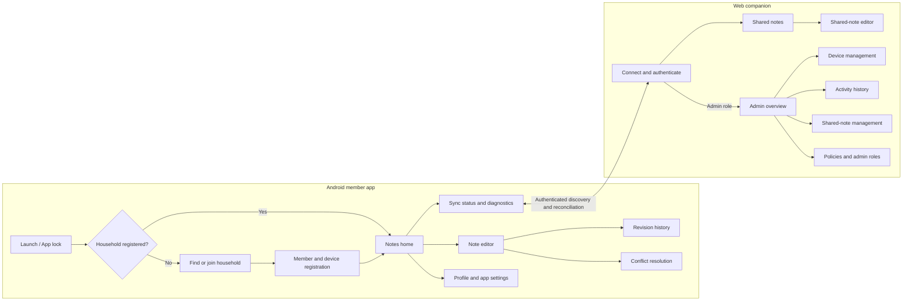
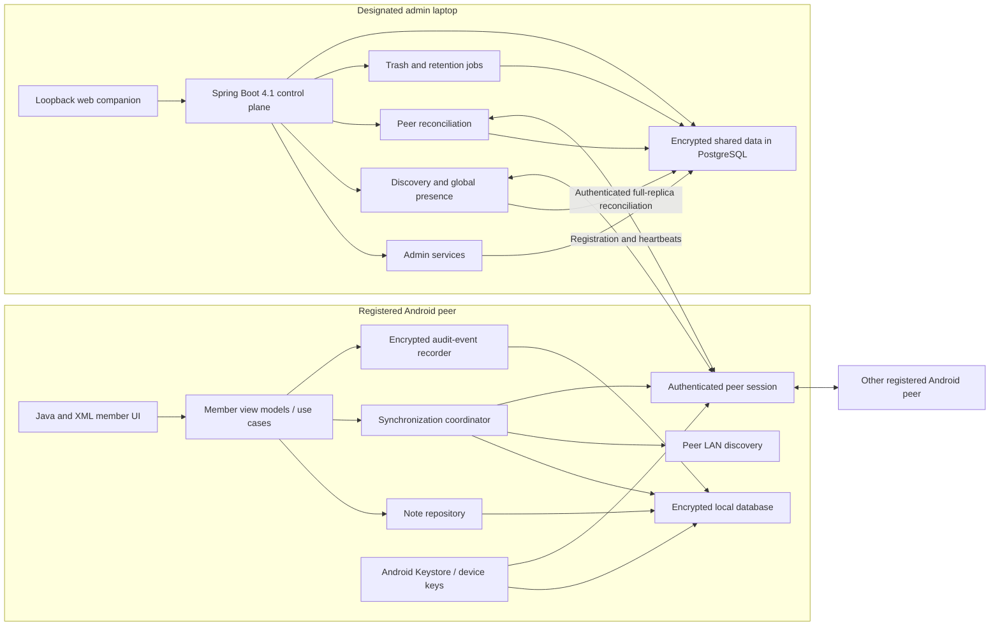
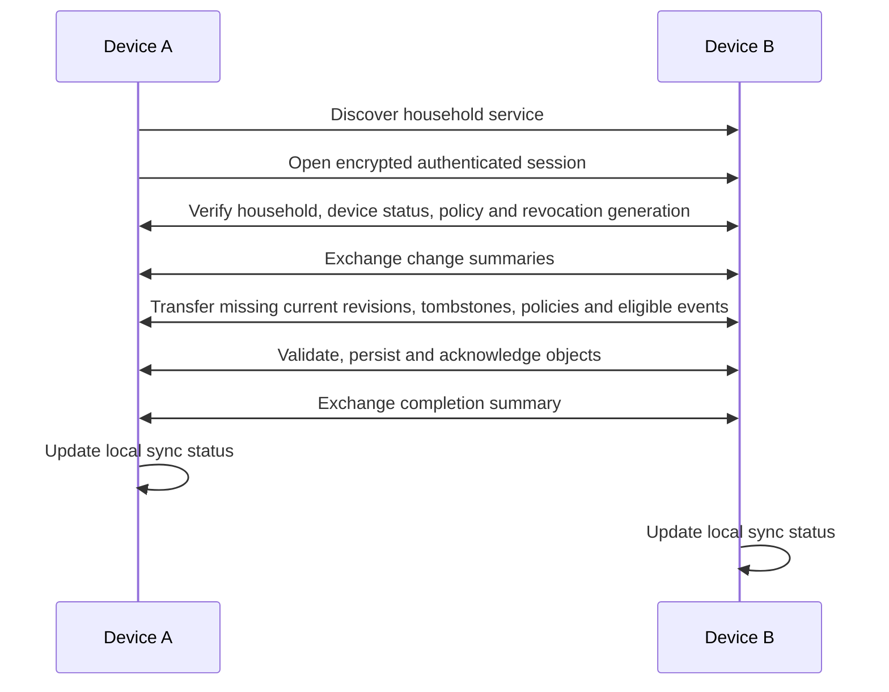

# NetBook Product and Application Design

**Companion specifications:** [requirements.md](requirements.md), [web-design.md](web-design.md)  
**Document status:** Version 1 Android data plane and laptop control-plane design  
**Last updated:** 2026-08-09

## 1. Design goals

The Android experience should feel like a familiar notes app first and a peer-to-peer system second. The designated laptop runs the stateful Spring Boot/PostgreSQL control plane, discovery service, and exclusive administrative console. Users should always understand:

- Whether a note is private or shared.
- Whether their latest changes are saved locally.
- Whether those changes have reached other devices.
- When another edit conflicts with theirs.
- That privileged controls exist only in the web companion.
- Whether the laptop control plane is online, reconciling, or unavailable without implying Android notes are blocked.

Security details should be visible when useful without making normal note editing depend on technical network knowledge.

## 2. Information architecture



## 3. Global navigation and common UI

The Android app uses a top app bar and bottom navigation:

- **Notes:** The normal private/shared note experience.
- **Sync:** Current device reachability and synchronization state.
- **Profile:** Member, device, privacy, and application settings.

The Android navigation and deep-link graph contain no admin destination. An admin member sees the same Android capabilities as any other member.

The web companion's complete member navigation is specified in [web-design.md](web-design.md). Authenticated admins additionally receive web-only navigation containing:

- **Overview**
- **Devices**
- **Activity**
- **Shared notes**
- **Policies and admins**

Common indicators:

- A lock/person icon and “Private” label for private notes.
- A family/devices icon and “Shared” label for shared notes.
- `Saved locally`, `Sync pending`, `Synced`, `Offline`, `Conflict`, or `Sync failed` status.
- An admin shield in the web app beside destructive or security-sensitive controls.
- Reachable-device count, such as “2 devices nearby,” without implying that all household devices are online.

## 4. Android member app page designs

### 4.1 Launch and app-lock page

**Purpose:** Protect local notes and route the user into setup or the existing household.

**Content:**

- App logo and household name when known.
- Biometric prompt or app-PIN entry when enabled.
- “Use device credential” fallback when supported.
- Clear offline-ready messaging; no internet login is shown.

**States:**

- First launch.
- Locked.
- Unlock failed.
- Local database unavailable or recovery required.
- Successfully unlocked and routing to Notes.

No household-wide audit event is created for app unlock attempts. Those attempts may be kept in a device-local security log.

### 4.2 Find or join household page

**Purpose:** Discover the household control plane created on the designated admin laptop and join it from Android.

**Content:**

- “Join a notebook on this network” action.
- “Set up the household on a laptop” help action when no discovery service exists.
- Current network name when Android permits access to it.
- Discovery status and list of discovered household identities.
- **Required permissions for discovery:** `android.permission.INTERNET`, `android.permission.ACCESS_WIFI_STATE`, and `android.permission.CHANGE_WIFI_MULTICAST_STATE`.
- Current enrollment mode: `Open registration` or `Admin approval required`.
- In open mode, explanation that no admin approval is required and warning that any person allowed onto the home LAN may be able to register.
- In approval-required mode, explanation that the device will remain pending until an admin acts.

Household creation is not an Android admin flow. The laptop Spring Boot setup initializes PostgreSQL, household identity, root admin, configuration defaults, and discovery service. Android then discovers or scans a code for that household.

**Join flow:**

1. Discover the laptop registry using mDNS/DNS-SD or enter/scan its direct authenticated address.
2. Authenticate the discovery service cryptographically.
3. Continue to registration.
4. In open mode, complete registration and receive current shared-note versions and policies.
5. In approval-required mode, submit a request and show the pending-registration page.

**Error states:**

- No household found.
- Wi-Fi/LAN unavailable.
- Local-network permission unavailable.
- Network blocks peer discovery.
- Laptop backend or discovery service is stopped.
- Household identity verification failed.

### 4.3 Member and device registration page

**Purpose:** Create the member/device identity required to join.

**Fields:**

- Name — required.
- Device name — automatically suggested and editable.
- Email — optional.

**Identity choice:**

- `I am a new family member` creates a new member identity. A duplicate display name does not merge identities.
- `This is another device for me` requires a one-time QR/code pairing with one of that member's existing registered devices. This prevents a typed name from granting someone another member's identity or admin role.
- Both paths follow the current enrollment policy. In open mode neither requires admin approval. In approval-required mode both remain pending until approved.

**Content and actions:**

- Explanation of whether the device will register immediately or require admin approval under the current policy.
- Privacy note explaining where the optional email is visible.
- “Join household” or “Create household” confirmation.
- Progress for key creation, registration, and initial synchronization.

**Success result:**

- Device identity stored securely.
- In open mode, `DEVICE_REGISTERED` is created, reachable admins are notified of the new device, and only current shared-note versions are downloaded.
- In approval-required mode, `DEVICE_REGISTRATION_REQUESTED` is created and the device enters the pending page without receiving note or household keys.

### 4.4 Pending-registration page

**Purpose:** Wait safely for an admin decision without granting household access.

- Member and device names included in the request.
- `Waiting for a web admin` status with the request time.
- Explanation that the device has no shared-note access yet.
- Automatic status check when the app is active on the home LAN.
- `Check again` and `Cancel locally` actions.
- Approved state continues into current-version bootstrap.
- Rejected state explains that access was not granted and permits a later new request unless blocked.

### 4.5 Notes home page

**Purpose:** Make private and shared notes easy to find without confusing their visibility.

**Layout:**

- Search field.
- Filter chips or tabs: `All`, `Private`, `Shared`, and `Conflicts` when relevant.
- Note cards showing title, short preview, visibility, modified time, last editor for shared notes, and sync state.
- Floating “New note” action.
- Compact banner for important states: new device joined, conflicts, repeated sync failure, or device revoked.

**New-note action:**

- Ask for `Private` or `Shared` before opening the editor.
- Remember the user's last choice only if the selected visibility remains visually obvious.

**Interactions:**

- Tap a note to open it.
- Search locally across accessible current note content.
- Sort by recently modified, created, or title.
- Android never shows shared-note deletion, move-to-private, or another admin-only action, regardless of the current member's role.

Empty states must separately explain “No private notes,” “No shared notes,” and “No peers reachable.”

### 4.6 Note editor page

**Purpose:** Create and safely edit one private or shared text note.

**Content:**

- Title field.
- Plain text or Markdown-capable body field.
- Highly visible Private/Shared status.
- Save state and last successful synchronization.
- Last editor and modified time for shared notes.
- Revision-history action.
- Overflow actions appropriate to note visibility and member capabilities; an admin role never adds privileged Android actions.

**Save behavior:**

- Save locally before attempting network synchronization.
- A successful content change creates a revision.
- An unchanged explicit save does not create a duplicate revision.
- A shared save queues automatic peer synchronization.
- Leaving with unsaved content triggers an autosave or an explicit discard confirmation.

**Visibility actions:**

- `Share with household`: warns that all registered devices may receive the note.
- `Copy to private`: available to every member; creates a device-local private copy and leaves the shared note unchanged. This private action is not added to the household audit log.

**Delete actions:**

- Private note: its owner can delete it locally.
- Shared note: Android shows no delete action. Shared-note deletion is available only in the web companion's admin area.

Opening a shared note creates `SHARED_NOTE_OPENED`. Merely displaying a note preview on the home page does not.

### 4.7 Revision-history page

**Purpose:** Inspect and restore saved content revisions.

**Content:**

- Current configured limit, defaulting to 5.
- Revision list with author, device, time, and current/restored/conflict labels.
- Read-only preview or difference view.
- “Restore as new version” action.

**Rules:**

- All eligible members may view shared-note revisions present on their device.
- Restoring creates a new current revision.
- Devices display only revisions they retained after registering; older history is not backfilled.
- If a policy reduction prunes history, the UI explains that older revisions expired under the admin policy.

### 4.8 Conflict-resolution page

**Purpose:** Preserve and reconcile concurrent offline edits.

**Layout:**

- Note identity and conflict explanation.
- “Version from this device” and “Version from another device” panes.
- Author, device, and save time for each version.
- Actions: `Use this version`, `Use other version`, and `Combine manually`.
- Combined editable result where screen size permits; a sequential view is acceptable on small screens.

**Result:**

- Both inputs remain preserved until resolution is saved.
- The resolution becomes a new revision with both conflicting revisions as parents.
- `SHARED_NOTE_CONFLICT_RESOLVED` is recorded.

### 4.9 Synchronization status and diagnostics page

**Purpose:** Explain peer-to-peer state without requiring networking expertise.

**Content:**

- Current LAN state.
- Laptop control-plane state: `Connected`, `Unavailable`, or `Reconciling`.
- Reachable registered peers.
- Last synchronization time per peer.
- Counts of pending notes, policies, tombstones, and activity events.
- Current conflicts and failures.
- “Sync now” action.
- Discovery-service address, last authenticated heartbeat, and last PostgreSQL reconciliation status when known.
- Diagnostic help for Wi-Fi client isolation, local-network permission, battery restrictions, or rejected identity.

The page must not claim “Everything is on every device.” It may state “No pending changes known to this device,” because offline peers can have undiscovered work.

Android never hosts or starts the web companion. If the laptop backend is unavailable, this page explains that Android notes and peer-to-peer synchronization remain usable while laptop persistence and administration are paused.

### 4.10 Member profile and application settings page

**Purpose:** Manage local identity and application preferences.

**Content:**

- Member name.
- Optional email.
- Current device name.
- Household and role.
- App lock/biometric settings.
- Notification preferences.
- Battery/background-sync guidance.
- Local storage and diagnostics.

Shared profile or device-name changes produce the applicable admin-visible event. Local-only appearance or notification changes do not.

## 5. Web companion admin-only page summary

The complete member and admin web experience is specified in [web-design.md](web-design.md). The following summary records the admin-only surfaces that must never be implemented as an Android route, activity, fragment, navigation destination, or hidden feature flag. Android peers may apply authenticated changes created by these pages, but cannot initiate them through Android UI.

### 5.1 Admin authentication and reauthentication page

**Purpose:** Elevate an authenticated web companion session to the current member's admin capabilities and reauthenticate sensitive actions.

**Content:**

- Household name and verified identity fingerprint.
- Current Java backend and PostgreSQL health.
- Admin identity selector when multiple identities exist.
- `Use passkey` authentication action and registered-passkey management.
- Connected discovery service and latest reconciliation time.

**States:**

- Web-device enrollment pending.
- Authentication required.
- Authenticated but no Android peer currently reachable.
- Connected and synchronizing.
- Admin authorization revoked or keys unavailable.

Root-admin bootstrap registers the first WebAuthn passkey on the loopback origin before admin routes become available. Admin login and sensitive-action reauthentication use passkey assertions verified by Spring Security. Version 1 has no password fallback or automated account/key recovery. Ordinary web-device enrollment and sessions are specified separately in [web-design.md](web-design.md).

### 5.2 Admin overview page

**Purpose:** Provide an eventually consistent operational view of the household.

**Summary cards:**

- Registered devices.
- Pending registration requests.
- Globally connected devices currently reporting to the discovery service.
- Devices not seen recently.
- Shared notes changed recently.
- Unresolved conflicts.
- Sync failures.
- Current revision limit and activity retention.
- PostgreSQL health and last successful reconciliation.
- Trash count and next scheduled purge.

**Recent activity:**

- Pending, approved, and rejected device registrations.
- New device registrations.
- Shared-note opens and edits.
- Shared-note deletions.
- Device/security changes.
- Recent synchronization failures.

**Required banner:**

“Control plane observed devices through `<time>`. Offline devices may have additional unsynchronized activity.”

The overview links to Devices, Activity, Shared notes, and Policies.

### 5.3 Admin device-management page

**Purpose:** Review pending requests, show who is registered, and control future access.

**Sections:**

- `Pending`: registration requests awaiting an admin decision, with Approve and Reject actions.
- `Registered`: active and blocked household devices.
- `Revoked`: identities that no longer receive future updates.

**Pending request row:**

- Requested member name, optional email indicator, and device name.
- Request time and origin identity fingerprint.
- Existing-member link claim when applicable.
- Approve and Reject actions with confirmation.

Approval creates `DEVICE_REGISTRATION_APPROVED`; completed registration creates `DEVICE_REGISTERED` when the joining device reconnects. Rejection creates `DEVICE_REGISTRATION_REJECTED`.

**Device row:**

- Member name and role.
- Device name and stable short device identifier.
- Registered member name, application name, platform, and Android manufacturer/model from the authenticated device record.
- Registered time.
- Reachable/offline status.
- Last seen and last successful sync.
- Connection start and latest authenticated heartbeat when currently connected.
- Latest authenticated heartbeat and discovery-service observation time.
- Blocked or revoked badge.

The page never invents friendly-looking devices or activity. Until a real Android registration or heartbeat is received, the UI shows an explicit empty or offline state.

**Device detail:**

- Recent connection sessions.
- Recent shared-note opens, saves, and transfers.
- Sync error summary.
- Rename, block, unblock, and revoke actions as appropriate.

**Revocation confirmation:**

- Explains that future access is blocked.
- Explains that previously downloaded notes remain on the device.
- Explains that keys for future data will rotate.
- Requires strong web-admin reauthentication.

### 5.4 Admin activity-history page

**Purpose:** Visualize the complete synchronized activity catalog within the configured retention window.

**Filters:**

- Date range.
- Category: Notes, Devices, Sync, Security, or Policy.
- Member.
- Device.
- Shared note.
- Success/failure outcome.

**Activity row:**

- Human-readable action.
- Actor member and device where applicable.
- Target shared note/device where applicable.
- Origin-recorded time.
- Outcome.
- Synchronization/source details in an expandable section.

**Examples:**

- “Asha opened ‘Shopping List’ on Asha’s Pixel.”
- “Ravi saved revision 18 of ‘Shopping List’.”
- “Revision 18 synchronized from Ravi’s Phone to Kitchen Tablet.”
- “Admin blocked Guest Tablet.”
- “Sync with Kitchen Tablet failed: peer unreachable.”

The page clearly distinguishes `opened` from `synchronized`. It never lists private-note activity.

### 5.5 Admin shared-note management page

**Purpose:** Let admins inspect household shared-note health and perform deletion.

**Content:**

- Searchable list of current shared notes, initially limited to 20 rows.
- `Show more` action that appends the next 20 matching rows.
- Filters for title, creator, last editor, modified-date range, and conflict state.
- Creator, last editor, latest revision, modified time, conflict state, and last known synchronization state.
- Note detail with recent access, save, conflict, and transfer activity.
- `Move to trash` action with strong reauthentication.
- `Move to private device…` coordinated workflow.
- Trash view with Restore and Permanently purge actions.
- Pending shared-to-private jobs and their selected Android destination.

The shared-to-private workflow keeps the shared note active until an eligible Android device owned by the initiating admin acknowledges durable private creation. It then moves the shared source to trash. Failure or timeout leaves the shared note unchanged.

This page reports PostgreSQL state plus the latest device receipts known to the discovery/reconciliation service. It must not present a missing or offline receipt as proof that a device lacks a note.

### 5.6 Admin policy and role-settings page

**Purpose:** Manage household-wide behavior and authorized administrators.

**Settings:**

- Home-LAN enrollment: `Open registration` (default) or `Admin approval required`.
- Saved revisions per note — default 5.
- Admin activity retention in days — default 100.
- Trash retention in days — default 30.
- Admin role and web-admin client management.
- Discovery heartbeat/offline thresholds within safe bounds.

**Interaction rules:**

- Validate whole-number history values.
- Explain that changing enrollment affects new devices only, not existing registered devices.
- Warn about the guest-access risk before enabling open registration.
- Show the latest enrollment-policy synchronization status known for each registered peer.
- Preview the effect of reductions before saving.
- Warn that lowering the revision limit prunes excess old content revisions.
- Warn that lowering activity retention purges newly expired activity.
- Warn that lowering trash retention can make items immediately eligible for permanent purge.
- Show whether a policy change is pending synchronization.
- Require strong reauthentication for role, key, enrollment, and destructive policy changes.
- Record `ENROLLMENT_POLICY_CHANGED`, `REVISION_LIMIT_CHANGED`, or `ACTIVITY_RETENTION_CHANGED` as applicable.

## 6. Activity creation design

### 6.1 Common event envelope

Every household activity event contains:

| Field | Purpose |
|---|---|
| `eventId` | Globally unique identifier used for deduplication. |
| `eventType` | One of the version 1 event types below. |
| `householdId` | Household boundary. |
| `occurredAt` | Origin Android device's or web admin client's event time. |
| `originClientType` / `originClientId` | Android device or web admin client that created the event. |
| `actorMemberId` | Acting member when the action has one. |
| `targetType` / `targetId` | Shared note, revision, device, member, session, or policy target. |
| `outcome` | Success, failure, rejected, conflict, or informational. |
| `metadata` | Event-specific, non-sensitive structured values. |
| `policyVersion` | Policy used to calculate retention. |
| `expiresAt` | Retention expiry for admin activity. |
| `authenticator` | Signature or authentication tag proving origin and integrity. |

Email addresses, encryption keys, note bodies, and complete old note content never appear in activity metadata. A note title may be encrypted inside an admin-only event payload or resolved locally using its note ID.

### 6.2 Version 1 event definitions

| Event | Actor and target | Important metadata |
|---|---|---|
| `HOUSEHOLD_CREATED` | Initial admin → household | Household display name and policy version. |
| `BACKEND_STARTED` | Laptop backend → control plane | Application version, configuration fingerprint, and database migration version. |
| `BACKEND_STOPPED` | Laptop backend → control plane | Graceful shutdown time and reason category. |
| `DISCOVERY_SERVICE_STARTED` | Laptop backend → discovery service | Bind/interface information and protocol version. |
| `DISCOVERY_SERVICE_STOPPED` | Laptop backend → discovery service | Graceful stop reason. |
| `DEVICE_PRESENCE_CHANGED` | Discovery service → device | Previous/new derived state and observation time. |
| `DEVICE_REGISTRATION_REQUESTED` | Joining identity → pending device | Requested member/device identity and enrollment policy version. |
| `DEVICE_REGISTRATION_APPROVED` | Web admin client → pending device | Request ID, approving admin, and policy version. |
| `DEVICE_REGISTRATION_REJECTED` | Web admin client → pending device | Request ID and optional safe reason category. |
| `DEVICE_REGISTERED` | Joining member/device → device | Device display name, member ID, registration LAN fingerprint/household identity result. |
| `DEVICE_CONNECTION_STARTED` | Origin device → peer session | Peer device, session ID, authenticated protocol version. |
| `DEVICE_CONNECTION_ENDED` | Origin device → peer session | Duration and normal/timeout/error category. |
| `DEVICE_RENAMED` | Member device or web admin client → device | Previous and new display names. |
| `MEMBER_PROFILE_UPDATED` | Member → member profile | Changed field names, not sensitive values such as email. |
| `ADMIN_ROLE_GRANTED` | Web admin client → member | Previous/new role and policy version. |
| `ADMIN_ROLE_REMOVED` | Web admin client → member | Previous/new role and policy version. |
| `DEVICE_BLOCKED` | Web admin client → device | Optional safe reason category. |
| `DEVICE_UNBLOCKED` | Web admin client → device | Resulting status. |
| `DEVICE_REVOKED` | Web admin client → device | Revocation version and key-rotation requirement. |
| `SHARED_NOTE_CREATED` | Member/device → note | Initial revision ID. |
| `SHARED_NOTE_OPENED` | Member/device → note | Current revision ID displayed. |
| `SHARED_NOTE_SAVED` | Member/device → note | New revision ID and parent revision ID. |
| `PRIVATE_NOTE_SHARED` | Member/device → resulting shared note | New shared ID and initial shared revision; no former private ID. |
| `SHARED_NOTE_REVISION_RESTORED` | Member/device → note/revision | Source revision and newly created revision. |
| `SHARED_NOTE_CONFLICT_DETECTED` | Detecting device → note | Conflicting revision IDs. |
| `SHARED_NOTE_CONFLICT_RESOLVED` | Member/device → note | Input revision IDs and resolution revision ID. |
| `SHARED_NOTE_TRASHED` | Web admin → note | Last active revision and trash retention deadline. |
| `SHARED_NOTE_RESTORED` | Web admin → note | Trashed revision and new restored revision ID. |
| `SHARED_NOTE_PURGED` | Web admin/retention job → note | Tombstone ID and manual/expired cause. |
| `SHARED_TO_PRIVATE_REQUESTED` | Web admin → note/Android device | Job ID and eligible target device. |
| `SHARED_TO_PRIVATE_COMPLETED` | Target Android/backend → job | Opaque acknowledgement and resulting trash entry. |
| `SHARED_TO_PRIVATE_FAILED` | Target Android/backend → job | Safe failure category and retryability. |
| `SHARED_TO_PRIVATE_CANCELLED` | Web admin → job | Cancellation reason category. |
| `SYNC_STARTED` | Origin device → peer session | Peer and queued item counts. |
| `SHARED_NOTE_SYNCED` | Sending/receiving device → note revision | Peer, direction, revision ID, byte count, accepted result. |
| `DELETION_SYNCED` | Sending/receiving device → tombstone | Peer, direction, note/tombstone ID, accepted result. |
| `SYNC_COMPLETED` | Origin device → peer session | Sent/received/skipped/conflict counts and duration. |
| `SYNC_FAILED` | Origin device → session/item | Safe error category, retryability, and item type/ID when appropriate. |
| `POSTGRES_RECONCILIATION_STARTED` | Laptop backend → reconciliation run | Peer and known backlog counts. |
| `POSTGRES_RECONCILIATION_COMPLETED` | Laptop backend → reconciliation run | Imported/exported/conflict counts and duration. |
| `POSTGRES_RECONCILIATION_FAILED` | Laptop backend → reconciliation run | Safe error category and retry state. |
| `UNAUTHORIZED_CONNECTION_REJECTED` | Rejecting device → remote identity | Known device ID when available and rejection category. |
| `ADMIN_COMMAND_REJECTED` | Rejecting peer → admin operation | Admin client, operation ID, and safe rejection category. |
| `HOUSEHOLD_KEYS_ROTATED` | Web admin/system → key generation | Cause, generation number, and distribution counts; never key material. |
| `ENROLLMENT_POLICY_CHANGED` | Web admin client → policy | Previous/new mode and policy version. |
| `REVISION_LIMIT_CHANGED` | Web admin client → policy | Old and new limit. |
| `ACTIVITY_RETENTION_CHANGED` | Web admin client → policy | Old and new day count. |
| `TRASH_RETENTION_CHANGED` | Web admin client → policy | Old and new day count. |
| `REVISION_HISTORY_PRUNED` | System/device → note or batch | Policy limit and number of revisions removed. |
| `ACTIVITY_HISTORY_PRUNED` | System/device → event batch | Cutoff time and number of events removed. |
| `WEB_DEVICE_APPROVAL_REQUESTED` | New web device → approval queue | Web device, member association, backend node, and policy version. |
| `WEB_DEVICE_ACCEPTED` | Web admin or home-LAN policy → web device | Acceptance method, accepting authority, backend node, and policy version. |
| `WEB_DEVICE_RENAMED` | Web member/admin → web device | Previous and new display names. |
| `WEB_DEVICE_BLOCKED` | Web admin → web device | Optional safe reason category and terminated sessions. |
| `WEB_DEVICE_UNBLOCKED` | Web admin → web device | Resulting status. |
| `WEB_DEVICE_REVOKED` | Web admin → web device | Credential generation and terminated sessions. |
| `WEB_SESSION_STARTED` | Accepted web device → web session | Backend node, session ID, and authenticated protocol version. |
| `WEB_SESSION_ENDED` | Web device/backend → web session | Duration and disconnect/expiry/termination/failure category. |
| `WEB_ACCESS_POLICY_CHANGED` | Web admin → web policy | Previous/new enrollment, timeout, or sync policy values. |
| `ADMIN_PASSKEY_REGISTERED` | Web admin/bootstrap → passkey credential | Admin, friendly credential name, and registration method; never public-key bytes or attestation payload. |
| `ADMIN_PASSKEY_REMOVED` | Web admin → passkey credential | Admin, opaque credential reference, removal reason, and remaining credential count. |
| `ADMIN_PASSKEY_REAUTHENTICATED` | Web admin → sensitive operation | Admin session, operation category, and assertion time; never challenge or authenticator data. |

### 6.3 Event-volume rules

- Connection events are per authenticated session, not per discovery packet.
- Presence heartbeats do not each create activity; only a derived online/offline/status transition creates `DEVICE_PRESENCE_CHANGED`.
- `SHARED_NOTE_OPENED` is created once when the full note is opened, not for list previews or every view rebind.
- `SHARED_NOTE_SYNCED` is recorded when a new current revision is accepted, not for duplicate/retry payloads.
- A clean sync with no changed objects creates session start/completion events but no note-transfer events.
- Admin session events are created per authenticated browser session, not per web request.
- A rejected privileged operation creates one `ADMIN_COMMAND_REJECTED` event per unique operation ID.
- Repeated identical failures may be grouped for presentation, but source events retain stable identifiers and counts.
- Prune events may summarize a batch to avoid one audit entry per deleted historical record.
- Reconciliation activity is one start and one terminal event per run, with counts instead of one database event per unchanged object.

### 6.4 Trust limitation

Audit events are authenticated reports from cooperating app installations. They are useful for family visibility and diagnostics, but they are not tamper-proof forensic evidence against a rooted, modified, or compromised device. The UI should not describe them as proof that a person read content.

## 7. Android data plane and laptop control plane

### 7.1 Major components



Suggested Android boundaries:

- Java activities, XML layouts, Material Components, and RecyclerView-based navigation.
- View models exposing immutable UI state.
- Use cases for note saves, private/shared copying, conflict resolution, registration, and member profile changes.
- No admin routes or view models exposed through the Android application UI.
- Room-compatible local persistence with database/content encryption.
- Android Keystore-backed key manager.
- Encrypted admin-event creation and opaque forwarding without an Android admin reader.
- NSD/mDNS-style LAN service discovery.
- Authenticated encrypted peer protocol with explicit schema/protocol versioning.
- WorkManager for deferred reconciliation plus foreground/in-app synchronization for timely active use.
- Continued operation when the laptop control plane is stopped.

Required laptop control-plane boundaries:

- Stateful Spring Boot backend and frontend in the NetBook companion repository.
- PostgreSQL as the durable full replica for all shared household data and the authority for policies, roles, registry state, trash, and activity retention.
- mDNS/DNS-SD discovery advertisement, authenticated direct-address fallback, and heartbeat-based global presence.
- Responsive browser UI for the six web admin pages.
- React with TypeScript, built by Vite and served as static assets by Spring Boot.
- Versioned JSON endpoints with Spring Security authorization on every request.
- WebAuthn passkey admin authentication and sensitive-action reauthentication with no password fallback.
- Admin-only presentation and creation of registration, device, role, deletion, and policy commands.
- Startup and scheduled reconciliation with Android peers using immutable revisions and idempotent receipts.
- Loopback-only admin HTTP binding by default. Remote browser access remains disabled until trusted HTTPS is configured.
- Application-layer encryption for shared content stored in PostgreSQL and versioned Flyway migrations.
- No web unit-test requirement; security-sensitive workflows still require documented manual acceptance verification.

The current web repository uses Spring Boot 4.1 and Java 25. The selected version 1 frontend is React with TypeScript and Vite. The production React bundle is packaged into the Spring Boot application; during development, the Vite server proxies versioned API requests to Spring Boot.

The requirements do not mandate a particular cryptographic library. The implementation must use reviewed platform or established cryptographic primitives rather than custom cryptography.

LAN discovery has two complementary paths:

- **Laptop discovery/registry service:** Advertised while the backend is running. It owns new registration, authenticated heartbeats, global presence, and control-plane reconciliation.
- **Android peer discovery:** Continues independently so already registered Android devices can synchronize on a common LAN while the laptop is stopped.

The home-LAN profile is a best-effort convenience boundary because ordinary Wi-Fi identifiers can be spoofed. The authenticated household exchange prevents a fake router with no registered household peer from serving notebook data, but it cannot make open registration equivalent to admin approval. Policy changes propagate eventually; the admin UI shows peers still known to have an older policy version.

### 7.2 Android peer session sequence



No note data is sent before household/device authentication and device-status checks succeed.

### 7.3 Web-admin command propagation

Privileged operations originate on the root-admin laptop:

1. The web admin strongly authenticates and confirms the operation.
2. The loopback browser creates an idempotent command inside its authenticated Spring Security session.
3. The backend validates the current admin role, reauthentication age, policy version, authorization, ordering, and replay protection.
4. The backend commits the command, resulting state, and audit event atomically in PostgreSQL.
5. The backend signs/authenticates the household operation and propagates it to reachable Android peers; offline peers receive it during later reconciliation.
6. An invalid, stale, unauthorized, or duplicate operation is rejected safely.
7. The web UI shows database commit state separately from device propagation state.

Android validates and applies propagated admin state but never exposes the privileged initiating control in the Android app.

### 7.4 Change and conflict model

- Each note has a stable globally unique ID.
- Each save produces an immutable revision snapshot with a globally unique revision ID.
- A revision identifies one parent for ordinary saves and multiple parents for conflict resolution.
- Peers exchange revision/change summaries before content.
- Duplicate records are ignored by stable IDs.
- Two revisions descending from the same base without descending from each other form a conflict.
- Conflicting current candidates remain available until a resolution revision names both as parents.
- Wall-clock time is display metadata, not the sole source of causal ordering.

### 7.5 New-device bootstrap

After laptop discovery and registration, the new device receives:

- Current member, device, role, revocation, and policy state.
- The current version of every non-deleted shared note.
- Current unresolved conflict candidates required to avoid data loss.
- No resolved content revision older than its registration point.
- No decrypted admin activity or privileged admin credential, even when the registering member has the admin role.

After bootstrap, normal revisions and activities created after registration propagate to the device. This satisfies current-version-only onboarding without disabling future revision history.

### 7.6 Trash and purge convergence

Moving a shared note to trash publishes a reversible trashed state. Android and normal web lists hide it, while PostgreSQL retains encrypted content and revisions for the configured period, default 30 days. Restore creates a new current revision. Permanent purge or retention expiry removes content and publishes a signed content-free tombstone. Tombstones are synchronization state and are not removed at the 100-day audit cutoff.

### 7.7 Backend stop and restart

1. During graceful shutdown, Spring stops accepting admin commands and records `BACKEND_STOPPED`.
2. Android devices continue local editing and peer synchronization without PostgreSQL.
3. On restart, Spring initializes PostgreSQL, starts discovery, and records `BACKEND_STARTED`.
4. Registered devices reconnect and submit heartbeats/change summaries.
5. Reconciliation imports missing immutable revisions and detects conflicts without using wall-clock last-write-wins.
6. The dashboard shows `Reconciling` until the known backlog completes.

Global presence exists only while the discovery service is running. After restart, historical values appear as `Last seen` until fresh authenticated heartbeats arrive.

### 7.8 Coordinated shared-to-private move

```mermaid
sequenceDiagram
    participant W as Web admin
    participant L as Laptop backend
    participant A as Target Android device
    participant P as PostgreSQL

    W->>L: Request move to owned private device
    L->>P: Persist pending job
    L->>A: Authenticated private-delivery request
    A->>A: Create encrypted private copy durably
    A-->>L: Opaque success acknowledgement
    L->>P: Mark job complete and shared note trashed
    L-->>W: Completed; propagation pending/complete
```

If the Android device is offline or storage fails, the job remains pending or fails and the shared note remains active. The backend never stores the resulting private note content or ID.

## 8. Encryption and key design

The implementation should separate these concerns:

1. **Device identity key:** Identifies and authenticates one app installation.
2. **Local wrapping/database key:** Protects the device database and is itself protected by Android Keystore.
3. **Household shared-data generation key:** Encrypts shared-note payloads for currently registered, non-revoked devices.
4. **Web-device credential:** Identifies an accepted browser profile without containing note content or household shared-data keys.
5. **Admin audit protection:** Android peers may retain encrypted audit envelopes; only an authenticated admin view through the web companion may decrypt/present them.
6. **Privileged-operation authorization:** Binds the authenticated web session, current admin member, laptop identity, policy version, and idempotent command to an authenticated household operation.
7. **PostgreSQL envelope encryption:** Shared payloads are encrypted with data keys wrapped by a laptop master key stored outside PostgreSQL, preferably in the operating-system keystore.
8. **Root-admin recovery:** The primary secrets live on the laptop. Automated key, account, and database recovery are explicitly outside the current version 1 plan, so loss of the laptop or its passkeys may be unrecoverable.

Private notes use device-local encryption and never use household synchronization keys.

When a device is revoked:

1. A signed revocation update is created.
2. Valid peers reject the revoked identity.
3. New shared-data and admin key generations are created as applicable by an authorized web admin workflow.
4. New generations are wrapped only for eligible devices.
5. Existing encrypted data is not recalled or required to be rewritten.

This protects future updates while preserving the explicit decision that historical data already held by a revoked device remains intact.

## 9. Notification design

Useful Android notifications include:

- A registration request was approved or rejected — the requesting device when it next checks on the home LAN.
- A shared note changed while the app was not active.
- A shared-note conflict needs resolution.
- Repeated synchronization failure.
- The current device was blocked or revoked.

The active web companion admin area shows:

- Pending registration requests.
- New device registrations.
- Repeated security or synchronization failures.
- Completion or failure of an admin operation.

Version 1 sends no closed-browser or operating-system admin notifications. Pending items appear when the web companion is next opened.

Notification previews must not reveal private-note content and should hide shared-note content when the device lock screen is configured to conceal sensitive notifications.

## 10. Error and edge-state design

| Condition | User-facing behavior |
|---|---|
| No peers reachable | Notes remain editable; shared saves show `Sync pending`. |
| Router isolates clients | Diagnostics explains that devices cannot see each other and suggests router/Wi-Fi checks. |
| Concurrent edit | Both versions are retained and the note shows `Conflict`. |
| Peer has invalid identity | Connection rejected; admin security activity created when safe. |
| Current device revoked | Shared synchronization stops; existing local data is not falsely reported as erased. |
| Key generation out of date | Synchronize security state before note payloads; show a recoverable security-sync status. |
| Storage full | Preserve already committed data, prevent misleading save success, and show corrective action. |
| Device clock is wrong | Show origin time with uncertainty where detected; do not use it alone for conflict ordering. |
| Policy changed offline | Apply the authenticated newest policy version after synchronization and show resulting pruning. |
| Admin activity not fully synchronized | Show “current through” time and known pending event count. |
| Laptop backend is stopped | Web/admin/global presence are unavailable; Android notes continue normally and reconcile after restart. |
| PostgreSQL is unavailable | Reject new admin/database commits, preserve Android operation, and show a blocking database diagnostic. |
| Backend is reconciling | Show database and device convergence progress without claiming all devices are current. |
| Admin command is pending propagation | Show the signed operation as pending until a valid peer acknowledges it. |
| Admin command is rejected | Show the safe rejection reason and do not retry an invalid operation automatically. |

## 11. Accessibility and visual direction

- Visibility must never be communicated by color alone; always pair color with text and iconography.
- Web-admin actions use both a shield icon and an Admin label where ambiguity exists.
- Touch targets and typography follow current Android and web accessibility guidance on their respective surfaces.
- Note editing prioritizes content space; peer and encryption details remain available through status surfaces.
- Destructive shared-note actions require an explicit confirmation that names the note.
- Conflict panes support screen readers by presenting each version sequentially with clear author and time labels.

## 12. Implementation slices

The product can be delivered in these coherent slices:

1. Local encrypted Android private/shared note model and peer synchronization.
2. Spring Boot/PostgreSQL laptop bootstrap, migrations, configuration binding, and root-admin setup.
3. Discovery registry, authenticated heartbeats, global presence, and Android fallback peer discovery.
4. Full PostgreSQL shared-data reconciliation, idempotency, conflicts, and backend restart recovery.
5. React/TypeScript/Vite UI, versioned Spring Boot JSON API, Spring Security passkeys, loopback admin console, 20-row note pagination, filters, roles, and device management.
6. Admin policy propagation, key rotation, activity retention, and encrypted audit visualization.
7. Admin-managed trash, restore/purge jobs, and coordinated shared-to-private delivery.
8. Diagnostics, accessibility, and security hardening. Backup/recovery and non-local web access remain deferred.

The Spring Boot web repository does not require unit tests under the current product decision. Web slices use documented manual acceptance checks for permissions, encryption boundaries, destructive operations, device revocation, PostgreSQL recovery, and private-data exclusion. Android verification remains governed by the Android implementation plan.

## 13. Deferred design topics

The product owner intentionally deferred native Android administration, internet-wide discovery/presence, non-local browser HTTPS, automated key/database recovery, delegated-admin promotion, laptop autostart/standby, and stricter private-delivery targeting. These topics do not block the current design and retain the safe defaults recorded in [requirements.md](requirements.md#14-settled-and-deferred-decisions).

## 14. Current implementation status

The baseline now contains the first working control-plane path. Android discovers `_netbook._tcp` with `NsdManager`, registers an installation with the laptop, stores the returned bearer token, sends immediate and periodic heartbeats, and synchronizes `SHARED` Room records through the laptop API. The connected-devices screen reads the authenticated registry rather than treating discovered mDNS services as devices.

### 14.1 Current constraints

1. The existing permissions (`INTERNET`, `ACCESS_WIFI_STATE`, and `CHANGE_WIFI_MULTICAST_STATE`) are required for this path.
2. The laptop must advertise the service and run PostgreSQL; a stopped control plane cannot provide registration, web notes, or global device presence.
3. Private notes never enter the sync request. The current mobile transport is bearer-authenticated HTTP on the trusted home LAN and must be upgraded to TLS for an untrusted network.
4. This is laptop-mediated synchronization. Direct Android-to-Android discovery, encrypted peer sessions, registration approval, key exchange, and an Android conflict-resolution screen remain design work.
